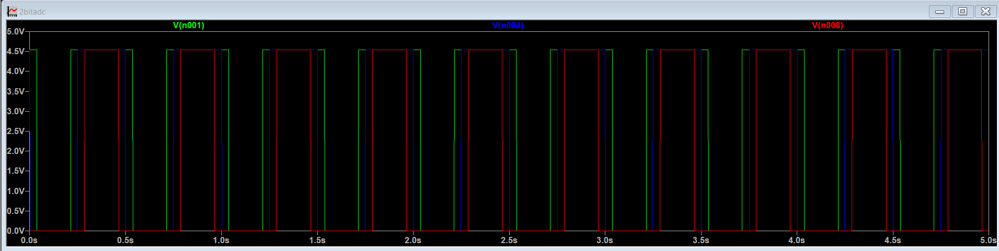
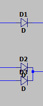
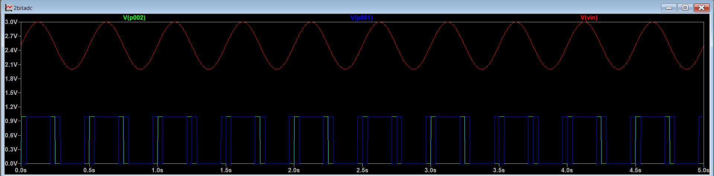

### 2 BIT ADC DESIGN AND ANALYSIS

An n bit ADC gives every sampled AC value a digital value based on certain thresholds to produce a digital signal of n bits

## DESIGN:
- For an n bit ADC, $2^n -1$ op amps are required
(Here I have taken ideal op amps and not the one given in the question as it produces an output between 1 and 4 which the combinational gates arent able to analyse in LTspice)
- The voltage (peak to peak of the AC source) is divided into 4 thresholds and fed into op amps --> every 0.25V increase makes the ADC move to the next digital state
- The op amps then give this output:

- For LSB, both the only green and all of red regions need to be 1, so I used diodes D2 and D3 to take the output of the xor and the last comparator:

- I have also included another op amp to step up the voltage to 5V as the XOR gate gives output as 1V

- This is the final output of both MSB AND LSB overlaid, the pattern is 00 01 10 11 11 10 01 00

## ANALYSIS

- The resolution of the ADC is the number of discrete values it produces, in this case 4
- The number of comparators scales exponentially with the increase in bits making it significantly more complex
- A priority encoder can also be used to produce the output
