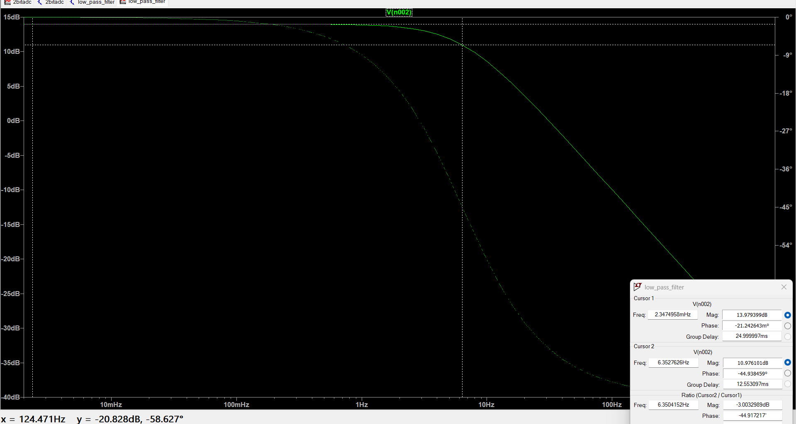
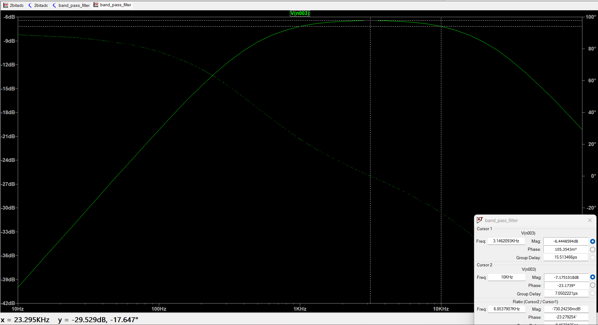

# RC FILTER ANALYSIS

## 1. PASSIVE LOW PASS FILTER:

Simulates a passive low pass filter using an RC circuit in LTspice, shows the cutoff behaviour

### TRANSFER FUNCTION CALCULATION:
The voltage across the capacitor is measured as $V_out$
- Impedance of capacitor   $Z_C = \frac{1}{j2πfC}$
- Resistance = R

$V_{out} = V_{in}*(\frac{Z_C}{R+Z_C})$
$H(jW) = \frac{V_{out}}{V_{in}} = \frac{1}{1+jWRC}$

The cut off frequency is at the -3dB point where RWC = 1
in this case:
- $R = 500Ω$
- $C = 50μF$
- $f_c = 6.3664Hz$

### VISUALISATION OF $f_c$:

## 2. PASSIVE BAND PASS FILTER:

Simulates a passive band pass filter (1kHz to 10kHz) using a high pass filter and a low pass filter connecte in LTspice, shows the cutoff behaviour

### TRANSFER FUNCTION CALCULATION:
A passive band pass filter can be modeled as the product of transfer functions of a high pass and a low pass filter
HPF:
- $R1 = 159Ω$
- $C1 = 1μF$
- $f_ch = 10kHz$

$$H_{HP}(jW) = \frac{jWR_1C_1}{1 + jWR_1C_1}$$

LPF:
- $R2 = 15.9Ω$
- $C2 = 1μF$
- $f_cl = 1kHz$

$$H_{LP}(jW) = \frac{1}{1 + jWR_2C_2}$$

$$H_{BP}(jW) = H_{HP}(jW) \cdot H_{LP}(jW)$$

### VISUALISATION OF $f_c$

